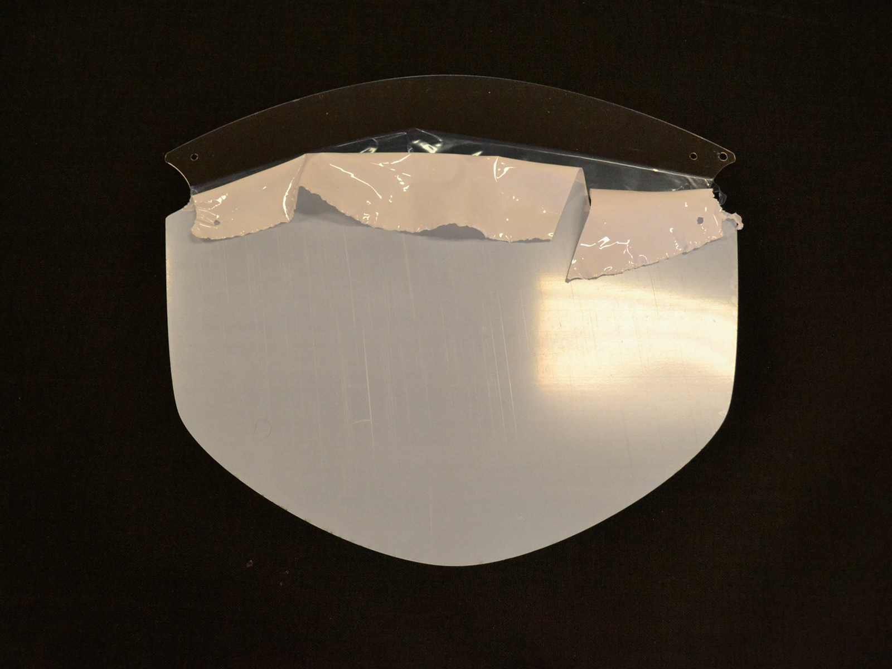

Vizir iz umetnih mas smo na [Zavodu 404](https://404.si/) razvili za dodatno zaščito obraza (oči, nosu in ust). Izdelan je iz prozornega materiala Lumex, ki je primeren in certificiran za uporabo v prehrambeni industriji. Preprosta je tudi njegova dezinfekcija.

Vizir nudi dodatno zaščito obraza kot ovira za kapljični prenos (kapljice, pršenje …). Vizir ni certificirana zaščitna oprema in ni kvalificiran kot medicinski pripomoček.

Njegova uporaba je smiselna in etična le v trenutnih razmerah, v katerih je zaradi slabe preskrbe z zaščitnimi sredstvi, uporaba takih in podobnih – v zelo kratkem času razvitih – rešitev nujna.

***

# Navodila za izdelavo vizirja

## Kaj potrebujete?
### Material
* načrte za izrez: poišete jih lahko v mapi AI ali DXF;
* plošče Lumex A (zastorka vizirja) ali podobna in dovolj debela plastična transparentna folija, ki se ne ukloni prehitro;
* KOTERM oz. PE – polietilen (nosilec, obroč za okrog glave), plastična plošča, lahko tudi drug material, ki je dovolj trden in hkrati upogljiv, da se ne bo zlomil;
* dve matici (M4, DIN 985), dve podložki (M4, DIN 125) in dva vijaka iz nerjavnega jekla (M4, ISO 7380);
* dve gumici (dolžina približno 60 cm) in dva plastična štoperja (lahko uporabite tudi iz starih oblačil) - plastični držali za vrvice;

### Orodje in oprema
* laserski rezalnik;
* ključ (velikost 7);
* baterijski vijačnik z imbus nastavkom;

## Postopek izelave
### Korak 1
Izrezano zastorko položite na delovno površino. Zastorko režite, ko je ta obdana z zaščitno folijo.

### Korak 2
Na obeh straneh zastorke (izrezane plastične plošče) odlepite nekaj centimetrov zaščitne folije. Nujno jo odlepite vsaj čez luknje, saj bo to kasneje, pri sestavljenem vizirju, veliko težje.

### Korak 3
Pripravite matici, podložki in vijaka, poravnajte luknje in zastorko ter držalo privijačite skupaj. Bodite pozorni, da so “ušesa” na držalu obrnjena navzgor ter da je matica na zunanji strani vizirja.

### Korak 4
Vzemite obe elastiki in ju na način, ki je prikazan na sliki, vstavite skozi luknji.

### Korak 5
Elastiki potisnite tudi skozi luknjice na drugi strani, nato pa še skozi oba štoperja. Štoper morate, ko skozi potiskate elastiko, stisniti skupaj, nato pa ga sprostite. Čim bolj zategnite elastike skupaj, da vam jo ostane dovolj za enostavno izvedbo vozla.

### Korak 6
Na koncu naredite še dva vozla, po enega na vsaki elastiki. Štoperje lahko nato sprostite, da se vizir postavi v najširšo lego.

### Vizir je izdelan!
To je to! Uspešno ste sestavili zaščitni vizir SI-101.

***

## Opozorilo
Zaščitni vizir ni medicinski pripomoček niti osebna varovalna oprema, zato ne zagotavlja popolne zaščite pred okužbo z boleznijo COVID-19 ali morebitnimi drugimi boleznimi. Zaščitni vizir ni certificirana in je namenjena zgolj za osebno uporabo neprofesionalnih posameznikov. Proizvajalec vizirja zato ne jamči za njene morebitne napake ali za škodo, ki bi zaradi uporabe vizirja morebiti nastala. Pri uporabi vizirja je treba dosledno spoštovati navodila za uporabo.
